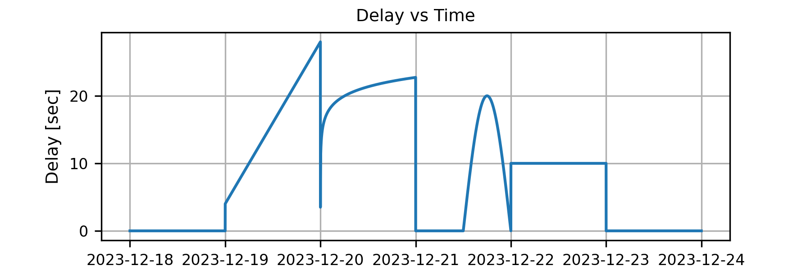

# Communication Delay Settings

ECHO supports three delay modes:

- **Fixed Delay**: constant delay in seconds.
- **Piece-wise Function**: functions of time with timestamp/delay entries.
- **Current Mars Delay**: pre-calculated delays by 4-hour intervals.

