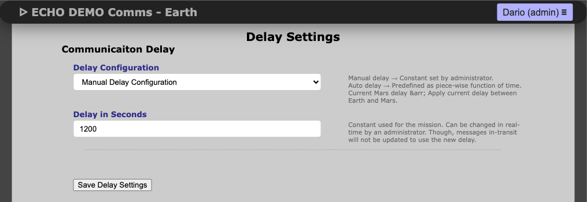
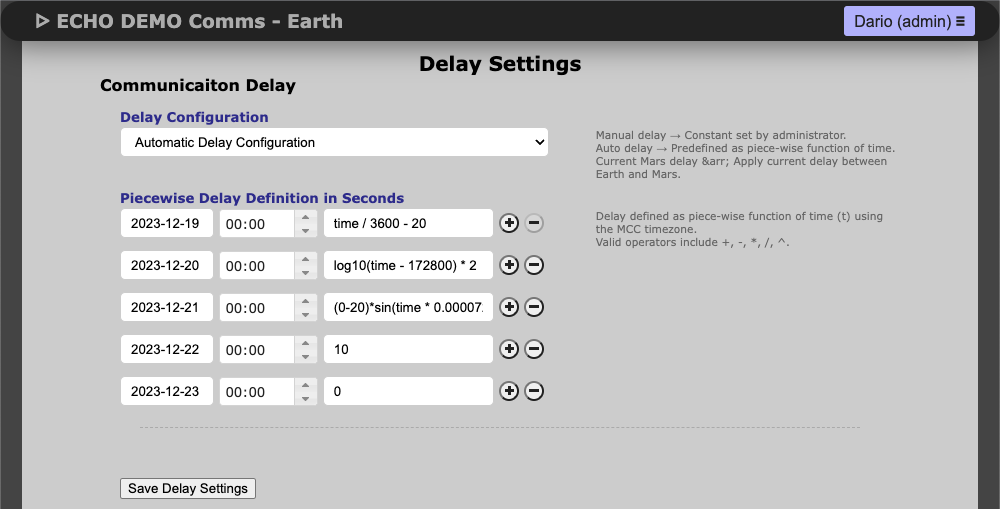
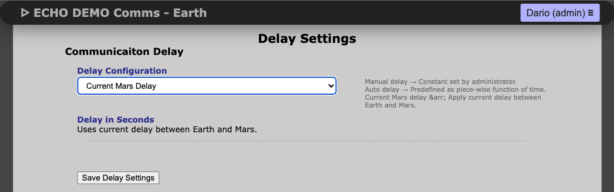

# Communication Delay Settings

ECHO supports three delay modes:

- **Fixed Delay**: constant delay in seconds for all messages sent between the analog habitat and mission control. This is useful for training sessions where you want a stable delay (e.g., 0 sec for real-time or 1200 sec for a 20‑minute OWLT).


- **Piece‑wise Function of Time**: a time‑varying delay defined by a list of timestamp/function pairs. Each pair tells the system when that function becomes active. The keyword `time` represents Mission Elapsed Time (MET) in seconds since the Mission Start Date (set in Mission Settings), and can be used inside equations that combine numbers, operators, and supported math functions. This lets you model delays that step, ramp, or evolve over time.


- **Current Mars Delay**: pre‑calculated communication delays on 4‑hour intervals (2020–2039). The system checks the current time and applies the closest applicable delay, approximating Earth‑to‑Mars OWLT.


**Piece‑wise Example (Dissertation)**
The profile below matches the dissertation example and the plot shown on this page.

Formula form:
$$
delay(t_{MET})=
\begin{cases}
\frac{t_{MET}}{3600}-20 & \text{for } 2023\text{-}12\text{-}19 \le t_{MET} \le 2023\text{-}12\text{-}20 \\
\log_{10}(t_{MET}-86400\cdot 2) & \text{for } 2023\text{-}12\text{-}20 \le t_{MET} \le 2023\text{-}12\text{-}21 \\
-20\sin\left(t_{MET}\cdot \frac{2\pi}{86400}\right) & \text{for } 2023\text{-}12\text{-}21 \le t_{MET} \le 2023\text{-}12\text{-}22 \\
10 & \text{for } 2023\text{-}12\text{-}22 \le t_{MET} \le 2023\text{-}12\text{-}23 \\
0 & \text{otherwise}
\end{cases}
$$

UI rows (each row is a start timestamp and equation):
```text
2023-12-19 08:00:00 -> time/3600 - 20
2023-12-20 08:00:00 -> log10(time - 172800)
2023-12-21 08:00:00 -> -20 * sin(time * (2*pi/86400))
2023-12-22 08:00:00 -> 10
2023-12-23 08:00:00 -> 0
```


