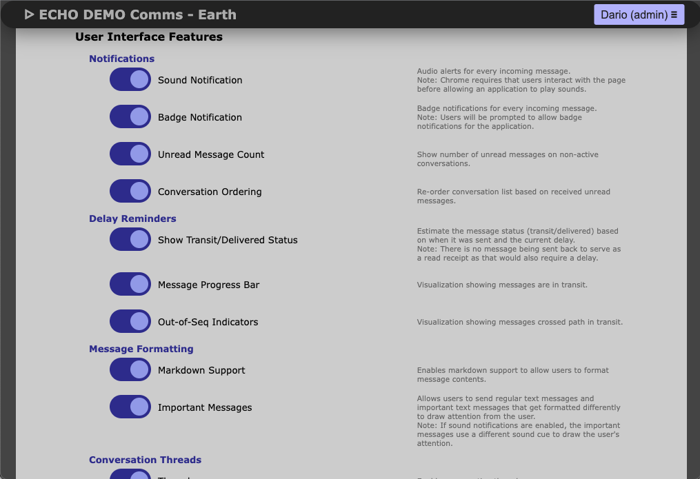

# Mission Settings

The mission settings page allows the mission administrator to configure the mission details, such as the mission name, start and end dates, the communication delay settings, and to enable or disable specific features in the software. When making changes, remember to scroll down to the bottom of the page and press the **Save Mission Configuration** button.

## Mission details

- **Mission Name**: Name displayed in the login page, top of the chat window, and associated with archives for mission communications.
- **Mission Start Date**: The date/time when the mission starts. Used as the epoch for mission day calculations and piece-wise delay functions.
- **Mission End Date**: The date/time mission ends; stops mission-day progression.
- **Name for Mission Control**: Displayed in the chat window for mission control (e.g., ILMAH).
- **Location for Mission Control**: Displayed in the chat window for mission control (e.g., Earth or Houston).
- **User Role for Mission Control**: Displayed in the chat window for mission control (e.g., Mission Controller).
- **Timezone for Mission Control**: Timezone displayed for mission control.
- **Name for Analog Habitat**: Displayed in the chat for analog habitat (e.g., Mission Support).
- **Location for Analog Habitat**: Displayed location for analog habitat (e.g., Mars).
- **User Role for Analog Crew**: Displayed role for habitation team (e.g., Astronaut or Aquanaut).
- **Timezone for Analog Simulation**: Timezone displayed for the analog habitat.
- **Name for Mission Day**: Label for mission day (e.g., Day or Sol).

## Feature toggles

- **Sound Notifications**: Plays sound for new messages. With high importance enabled, normal and high-priority messages have different sounds.
- **Badge Notifications**: Browser badge for new messages (mobile browsers may have issues).
- **Unread Message Count**: Shows unread count per conversation. When threads are on, shows unread count per thread. If high-priority is enabled, includes a red double-exclamation indicator.
- **Conversation Ordering**: Sorted by latest messages received; if disabled, sorted by user creation order.
- **Show Transit/Delivered Status**: Displays "Transit" or "Delivered" in the bottom right corner of each message.
- **Message Progress Bar**: Visual progress bar for simulated delay.
- **Out-of-Seq Indicators**: If received ordering is chronological but sent times are out-of-sequence, a marker appears to indicate potential context risk.
- **Markdown Support**: Enables markdown formatting for message content.
- **Important Messages**: Enables high-priority messages.
- **Threads**: Enables conversation threads.
- **Anyone Can Create Threads**: If enabled, all users can create threads; otherwise only admins can.

## Login timeout

- Configure login timeout appropriately; shorter timeout is recommended on public networks to reduce unauthorized session risk.

