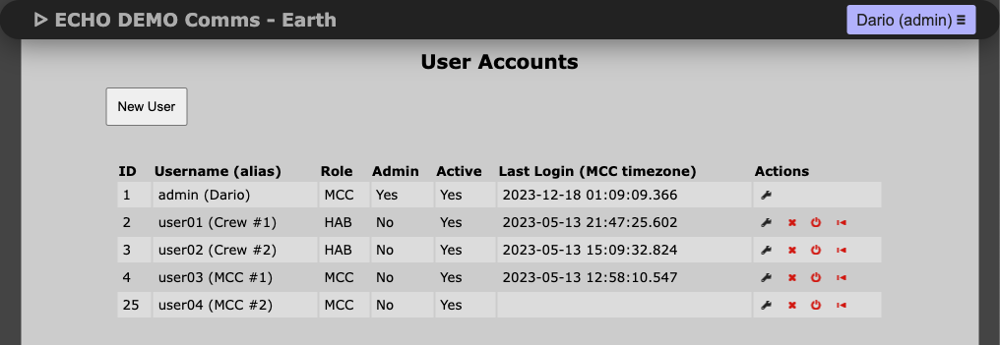

# Account Management

## Creating an account

1. Navigate to **User Accounts**.
2. Click **New User**.
3. Fill:
   - `Username`
   - `Name or Alias`
   - `Analog Role` (Astronaut / Mission Controller)
   - `Software Role` (Admin / User)
4. Click **Save User**.
5. Default password is `\$admin['default_password']` in `server.inc.php`.

## Editing an account

1. Go to **User Accounts**.
2. Click wrench icon on user row.
3. Update fields.
4. Click **Save User**.

## Deleting an account

- Deletion is irreversible.
- It removes user messages and private conversations.
- It is disabled during an active mission.

## Deactivate / Reactivate

1. Click power icon (red=active, green=inactive).
2. Confirm toggle action.

## Resetting passwords

1. Click rewind icon to reset password.
2. It resets to `\$admin['default_password']` in `server.inc.php`.

