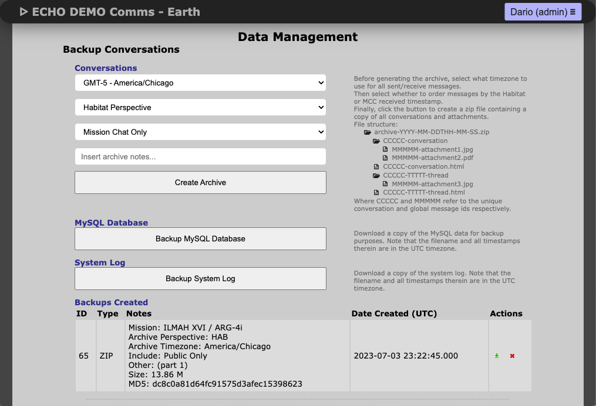

# Data Management

The Data Management page allows downloading archives, database backups, system logs, and resetting ECHO.

## Archives

- Download conversations and attachments.
- Can include public and private threads.
- Output is a ZIP file (max ~1GB; splits if larger).

## Database Backup

- Click **Backup MySQL Database** for SQL dump.
- Download from table after completion.

## System Logs

- Logs configuration changes and debug data.
- Click **Backup System Log** to download.

## Resetting ECHO

- **Delete All Data**: deletes messages, threads, attachments (keeps users/config).
- **Reset System Log**: clears the system log.

> Warning: Resetting is irreversible.

