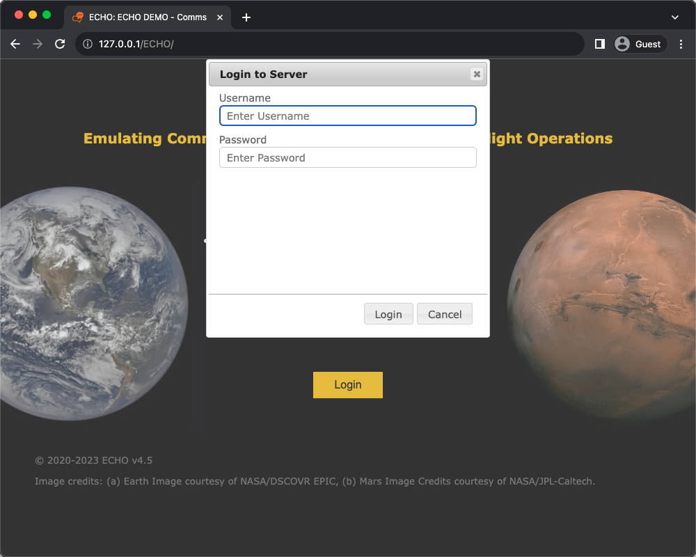

# Installation

1. Confirm server prerequisites:
   - Apache 2.4+ with `mod_rewrite` enabled.
   - PHP 7.4+.
   - MySQL 8.3+.
2. Clone repository:
   ```bash
git clone https://github.com/dschor5/ECHO.git
   ```
3. Create MySQL database and import `delay.sql` from repo root.
4. Copy `server-example.inc.php` to `server.inc.php`, and update settings.
5. Update `.htaccess` `RewriteBase` as necessary for your URL path.
6. Open ECHO URL in browser and log in with `admin`/`secret` (you will be prompted to change it).


