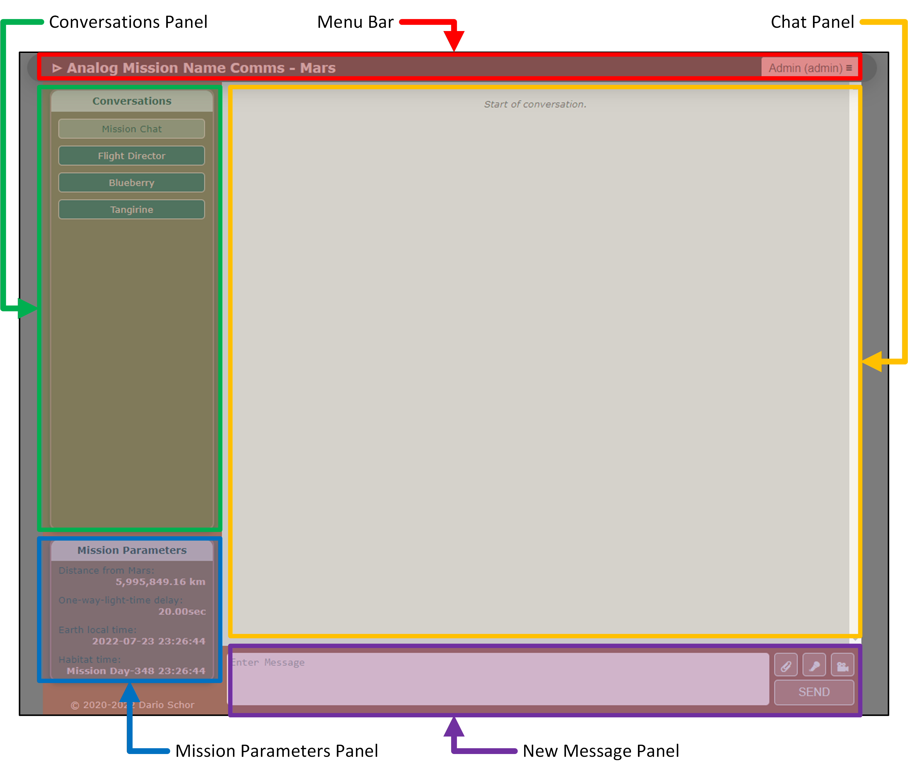

# Messaging Interface

The ECHO messaging interface has 5 areas:

- Menu Bar
- Conversations Panel
- Mission Parameters Panel
- New Message Panel
- Chat Panel

Mission Control (MCC) uses blue scheme; Habitat uses red scheme.

## Sending a Text Message

1. Type text in New Message Panel.
2. For high-priority, use the double exclamation icon.
3. Click `send`.
4. Message appears in Chat Panel with sent timestamp and status.

## Sending a Video Message

1. Click video camera icon.
2. Allow camera/mic access if prompted.
3. Click `Start Recording`.
4. Click `Stop Recording` when done.
5. Preview and click `Send Video`.

## Sending an Audio Message

1. Click microphone icon.
2. Allow mic access if prompted.
3. Click `Start Recording`.
4. Click `Stop Recording`.
5. Preview and click `Send Audio`.

## Sending a File Attachment

1. Click paperclip icon.
2. Use `Browse` to select file.
3. Add caption (optional).
4. Click `Send File`.

## Reading Messages

- Ordered by received timestamp.
- User messages are right-aligned; others are left.
- ID indicates source: `MCC-#` or `HAB-#`.
- Transit progress bar for in-flight delay.
- Shows sent/delivery time and status.
- Out-of-order flags for sequencing issues.
